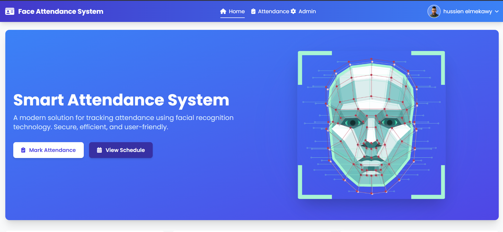

```markdown


# 🌐 UniFAS - Face Recognition Attendance System v2.0

A modern, web-based attendance tracking system powered by **facial recognition technology**. UniFAS offers a sleek and efficient way to register users, track attendance, and manage records with ease — all in a beautiful, responsive interface. 

> 🚀 **Now with enhanced course management, user profiles, calendar-based views, and a refined UI using TailwindCSS + AlpineJS!**

---

## 📚 Table of Contents

- ✨ [Features](#features)
- 🔍 [How It Works](#how-it-works)
- 🚀 [Installation](#installation)
- 🖥️ [Usage Guide](#usage-guide)
- 🔧 [Technical Details](#technical-details)
- 🗂️ [Project Structure](#project-structure)
- 📱 [New in Version 2.0](#new-in-version-20)
- 🤝 [Contributing](#contributing)
- 📄 [License](#license)

---

## ✨ Features

✅ **Facial Registration** – Add users by scanning their face using the webcam  
✅ **Live Recognition** – Detect and mark attendance in real-time  
✅ **Admin Control Panel** – View, update, and manage user records  
✅ **Course Management** – Create and manage courses, lectures, and materials  
✅ **User Profiles** – Enhanced profiles with activity tracking and statistics  
✅ **QR Code Integration** – Generate and download user ID cards with QR codes  
✅ **Interactive Calendar** – View schedule and attendance in calendar format  
✅ **Toast Notifications** – Modern notification system for better UX  
✅ **Responsive Design** – Works on all screen sizes (desktop + mobile)  
✅ **SSL-Ready** – Enable secure access using HTTPS  
✅ **Modern Frontend** – Enhanced using TailwindCSS + AlpineJS for a better UI experience

---

## 🔍 How It Works

🎥 **UniFAS** leverages face recognition algorithms to automate attendance:

1. **Register** – Capture facial data + info
2. **Recognize** – Scan faces live via webcam
3. **Record** – System matches and logs attendance

---

## 🚀 Installation

### ✅ Prerequisites
- Python **3.8 only**
- pip, Git

### 📦 Setup Steps

```bash
git clone https://github.com/hossmekawy/smart_attendance.git
cd smart_attendance

python3.8 -m venv venv
source venv/bin/activate   # or venv\Scripts\activate (Windows)

pip install --upgrade pip

# Install dependencies
pip install numpy==1.22.3
pip install Flask==2.0.1 Werkzeug==2.0.1 Jinja2==3.0.1 itsdangerous==2.0.1 MarkupSafe==2.0.1
pip install opencv-python-headless==4.5.5.64
pip install face_recognition==1.3.0 dlib Flask-SQLAlchemy==2.5.1

# For Windows dlib fix (if needed)
pip install https://github.com/jloh02/dlib/releases/download/v19.22/dlib-19.22.99-cp310-cp310-win_amd64.whl

# HTTPS cert
openssl req -x509 -newkey rsa:4096 -nodes -out cert.pem -keyout key.pem -days 365

python app.py
```

🌐 App runs at: [https://localhost:5000](https://localhost:5000) or your machine’s IP.

---

## 🖥️ Usage Guide

### 👤 Register a User
- Open the Register Page → Allow camera → Capture face → Submit

### 📸 Mark Attendance
- Open Attendance Page → Camera detects face → Logs automatically

### 🛠️ Admin Dashboard
- View/edit/delete users, audit activity, manage lectures

---

## 🔧 Technical Details

### 🧠 Face Recognition Flow
```python
face_locations = face_recognition.face_locations(image)
face_encodings = face_recognition.face_encodings(image, face_locations)
matches = face_recognition.compare_faces(known_encodings, face_encoding)
face_distances = face_recognition.face_distance(known_encodings, face_encoding)
```

### 🗃️ Database (SQLAlchemy + SQLite)
- `User` ➝ stores personal info + face encoding
- `Attendance` ➝ logs sessions with timestamps

### 💅 Frontend Stack
- **TailwindCSS** for UI
- **AlpineJS** for interaction
- **Jinja2** for templating

---

## 🗂️ Project Structure

```
smart_attendance/
├── app.py
├── camera.py
├── models.py
├── config.py
├── auth/
├── courses/
├── templates/
│   ├── base.html
│   ├── admin.html
│   ├── attendance.html
│   ├── auth/
│   └── courses/
├── static/
├── cert.pem
├── key.pem
└── requirements.txt
```

---

## 📱 New in Version 2.0

### ✨ Enhancements

#### 📚 Course Management
- Manage lectures, materials, and schedules
- Upload PDFs, PowerPoints, Excel files
- Monitor student material downloads

#### 👤 User Profiles
- Activity timeline, QR ID cards, attendance charts

#### 🖥️ UI & UX Overhaul
- Clean interface
- Mobile-friendly
- Toast alerts, calendar views

#### 🛠️ Backend Improvements
- Blueprint modular structure
- Better error handling
- Enhanced performance

---

## 🤝 Contributing

```bash
# Fork → Branch → Code → Commit → Pull Request 🚀
```

All help is welcome!

---

## 📄 License

This project is licensed under the [MIT License](LICENSE). Use freely with credit.
```

---

Let me know if you want this also as a downloadable `README.md` file or if you want to add **deployment instructions for Netlify, Heroku, or another host**.
